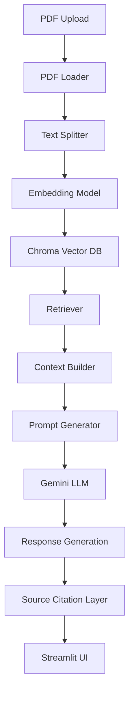
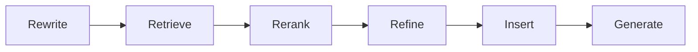
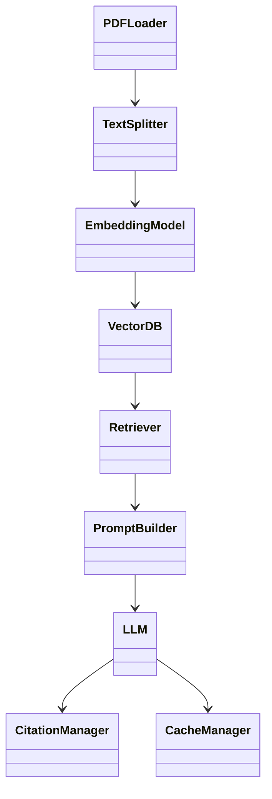

# 🤖 Advanced Multi-PDF RAG Chatbot

Advanced Retrieval-Augmented Generation (RAG) chatbot capable of answering questions from multiple uploaded PDFs using semantic retrieval and LLM-based generation with source citations.

---

## 🚀 Features

✅ Multi-PDF Upload Support  
✅ Semantic Search using Embeddings  
✅ ChromaDB Vector Storage  
✅ Source Citations  
✅ Persistent Database Support  
✅ Response Caching  
✅ Modular Architecture  
✅ Streamlit UI  
✅ Gemini Integration  
✅ Low Coupling & High Cohesion Design  

---

# 🏗 System Architecture



---

# 🔄 RAG Pipeline (Steel Thread Approach)



---

# 📦 Project Structure

```text
advanced-rag-chatbot/

│── app.py

│── requirements.txt

│── README.md

│── .gitignore

│── database/

│   └── chat_history.db

│

│── utils/

│   ├── pdf_loader.py

│   ├── text_splitter.py

│   ├── embeddings.py

│   ├── vectordb.py

│   ├── retriever.py

│   ├── prompt.py

│   ├── llm.py

│   ├── citations.py

│   ├── database.py

│   └── cache_manager.py
```

---

# 🧩 UML Component Diagram



---

# ⚙ Design Principles

## SOLID Principles

- Single Responsibility Principle
- Open / Closed Principle
- Dependency Separation
- Modular Design
- Low Coupling
- High Cohesion

---

# 🛠 Tech Stack

Python

Streamlit

LangChain

Gemini

ChromaDB

FAISS (optional)

SQLite

---

# ▶ Run Locally

```bash
git clone https://github.com/Iswarya952/advanced-rag-chatbot.git

cd advanced-rag-chatbot

pip install -r requirements.txt

streamlit run app.py
```

---

# 📈 Future Enhancements

- Hybrid Retrieval
- Reranking Layer
- Multi Agent Pipeline
- Graph RAG
- Context Compression
- Abstraction Layer Design
- Persistent Shared Repository
- UML Expansion

---

## 👩‍💻 Author

Iswarya
